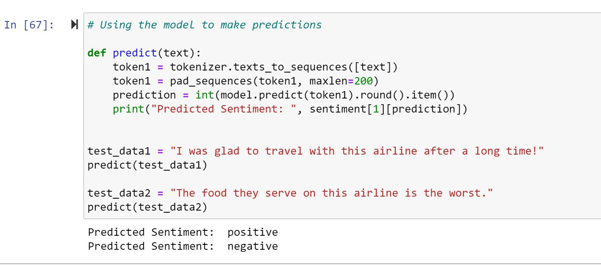

# Sentiment-Analysis
A binary text-classifier to categorize the reviews as positive or negative.
The Dataset "Tweets.csv" is taken from Kaggle - Twitter US Airline Sentiment dataset. It contains more than 14000 tweets classified as positive, negative or neutral.
Only the Positive and Negative are extracted here since it is a binary classifier.  
The libraries used are : Pandas, Tensorflow-Keras, Matplotlib.  
The architecture of the Classifier Model is as follows: 
1 Embedding Layer, 1 LSTM Layer, 1 Dense Layer and Dropout layers in between to avoid overfitting. 
The batch size of 32 for 5 epochs of training.  
The accuracy on the training dataset is 96% and 94% on the test dataset.  
Accuracy: 

 
Loss: 

 
Predicting the user sentiment: 

